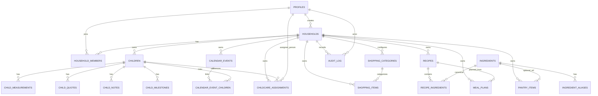

# ER Model

```mermaid
erDiagram
  PROFILES ||--o{ HOUSEHOLDS : creates
  PROFILES ||--o{ HOUSEHOLD_MEMBERS : joins
  HOUSEHOLDS ||--o{ HOUSEHOLD_MEMBERS : has

  HOUSEHOLDS ||--o{ CHILDREN : owns
  CHILDREN ||--o{ CHILD_MEASUREMENTS : has
  CHILDREN ||--o{ CHILD_QUOTES : has
  CHILDREN ||--o{ CHILD_NOTES : has
  CHILDREN ||--o{ CHILD_MILESTONES : has

  HOUSEHOLDS ||--o{ SHOPPING_CATEGORIES : configures
  HOUSEHOLDS ||--o{ SHOPPING_ITEMS : owns
  SHOPPING_CATEGORIES ||--o{ SHOPPING_ITEMS : categorizes

  HOUSEHOLDS ||--o{ CALENDAR_EVENTS : owns
  CALENDAR_EVENTS ||--o{ CALENDAR_EVENT_CHILDREN : links
  CHILDREN ||--o{ CALENDAR_EVENT_CHILDREN : links

  HOUSEHOLDS ||--o{ CHILDCARE_ASSIGNMENTS : owns
  CHILDREN ||--o{ CHILDCARE_ASSIGNMENTS : references
  PROFILES ||--o{ CHILDCARE_ASSIGNMENTS : assigned_person

  HOUSEHOLDS ||--o{ RECIPES : owns
  RECIPES ||--o{ RECIPE_INGREDIENTS : contains
  INGREDIENTS ||--o{ INGREDIENT_ALIASES : has
  INGREDIENTS ||--o{ RECIPE_INGREDIENTS : canonical

  HOUSEHOLDS ||--o{ MEAL_PLANS : owns
  RECIPES ||--o{ MEAL_PLANS : planned_from

  HOUSEHOLDS ||--o{ PANTRY_ITEMS : owns
  INGREDIENTS ||--o{ PANTRY_ITEMS : optional_ref

  HOUSEHOLDS ||--o{ AUDIT_LOG : records
  PROFILES ||--o{ AUDIT_LOG : actor
```

## Isolation rule

All private household tables include `household_id` and are protected by RLS.
