# ER Model

```mermaid
erDiagram
  PROFILES ||--o{ HOUSEHOLDS : creates
  PROFILES ||--o{ HOUSEHOLD_MEMBERS : joins
  HOUSEHOLDS ||--o{ HOUSEHOLD_MEMBERS : has

  HOUSEHOLDS ||--o{ CHILDREN : owns
  CHILDREN ||--o{ CHILD_MEASUREMENTS : has
  CHILDREN ||--o{ CHILD_QUOTES : has
  CHILDREN ||--o{ CHILD_NOTES : has
  CHILDREN ||--o{ CHILD_MILESTONES : has

  HOUSEHOLDS ||--o{ SHOPPING_CATEGORIES : configures
  HOUSEHOLDS ||--o{ SHOPPING_ITEMS : owns
  SHOPPING_CATEGORIES ||--o{ SHOPPING_ITEMS : categorizes

  HOUSEHOLDS ||--o{ CALENDAR_EVENTS : owns
  CALENDAR_EVENTS ||--o{ CALENDAR_EVENT_CHILDREN : links
  CHILDREN ||--o{ CALENDAR_EVENT_CHILDREN : links

  HOUSEHOLDS ||--o{ CHILDCARE_ASSIGNMENTS : owns
  CHILDREN ||--o{ CHILDCARE_ASSIGNMENTS : references
  PROFILES ||--o{ CHILDCARE_ASSIGNMENTS : assigned_person

  HOUSEHOLDS ||--o{ RECIPES : owns
  RECIPES ||--o{ RECIPE_INGREDIENTS : contains
  INGREDIENTS ||--o{ INGREDIENT_ALIASES : has
  INGREDIENTS ||--o{ RECIPE_INGREDIENTS : canonical

  HOUSEHOLDS ||--o{ MEAL_PLANS : owns
  RECIPES ||--o{ MEAL_PLANS : planned_from

  HOUSEHOLDS ||--o{ PANTRY_ITEMS : owns
  INGREDIENTS ||--o{ PANTRY_ITEMS : optional_ref

  HOUSEHOLDS ||--o{ AUDIT_LOG : records
  PROFILES ||--o{ AUDIT_LOG : actor

  HOUSEHOLDS ||--o{ FINANCE_ACCOUNTS : owns
  FINANCE_ACCOUNTS ||--o{ FINANCE_ACCOUNT_BALANCE_SNAPSHOTS : has
  HOUSEHOLDS ||--o{ FINANCE_CATEGORIES : configures
  HOUSEHOLDS ||--o{ FINANCE_CASH_FLOW_SERIES : owns
  FINANCE_CASH_FLOW_SERIES ||--o{ FINANCE_CASH_FLOW_DEFINITIONS : versions
  FINANCE_CASH_FLOW_DEFINITIONS ||--o{ FINANCE_CASH_FLOW_SPECIFIC_DATES : overrides
  FINANCE_CASH_FLOW_DEFINITIONS ||--o{ FINANCE_CASH_FLOW_OCCURRENCES : generates
  HOUSEHOLDS ||--o{ FINANCE_ASSUMPTION_SERIES : configures
  FINANCE_ASSUMPTION_SERIES ||--o{ FINANCE_ASSUMPTION_VALUES : has
  HOUSEHOLDS ||--o{ FINANCE_FORECAST_RUNS : owns
  FINANCE_FORECAST_RUNS ||--o{ FINANCE_DAILY_LIQUIDITY_FORECASTS : produces
```

## Isolation rule

All private household tables include `household_id` and are protected by RLS.

## Finance domain

See `docs/FINANCE_DOMAIN.md` for the full table-by-table description, calculation
rules and documented deviations from the original Finance spec.
